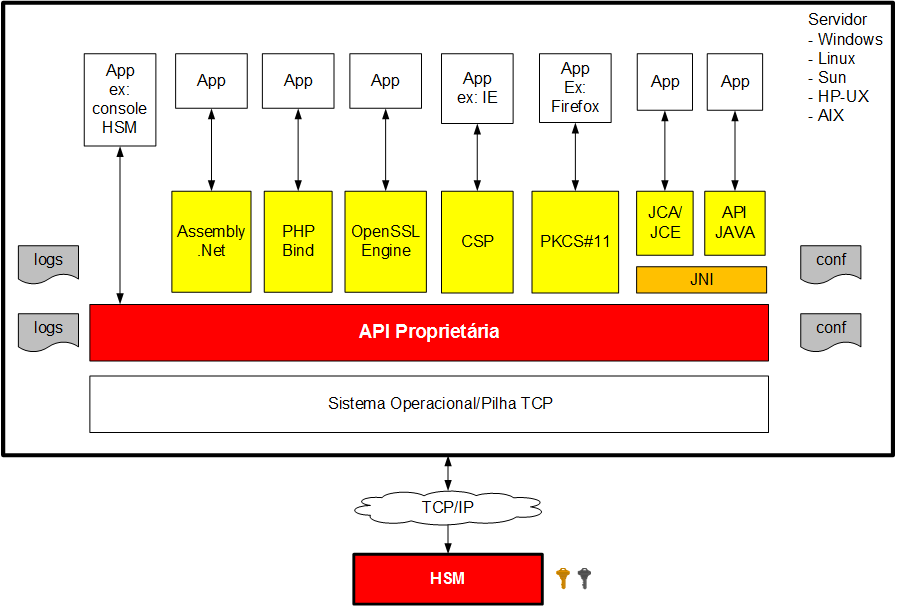

Bemvindo ao Wiki do client do HSM !!

O HSM Dinamo provê uma interface de programação cliente bastante rica e versátil, permitindo uma rápida e fácil integração em qualquer tipo de aplicação.

uma nova linha de fix

mais uma de feature